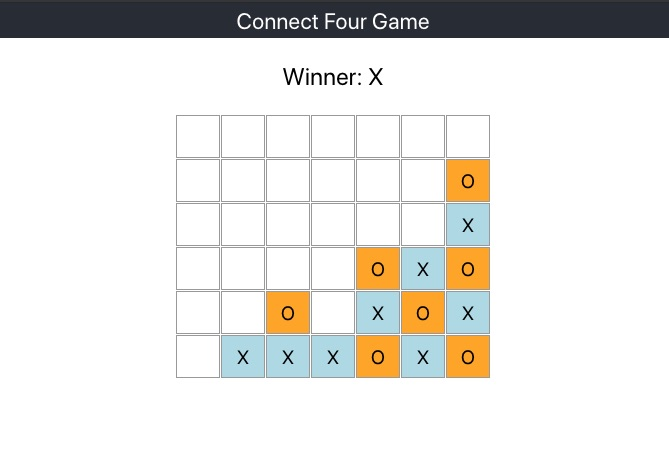

# Connect 4 Game

This project was bootstrapped with [Create React App](https://github.com/facebook/create-react-app).

## Game rules: four in a line

- Point the cursor over the row you wish to drop your piece in.
- Left click to drop your piece
- When you can connect four pieces vertically, horizontally or diagonally you win

## Advanced feature of my game

The dimension of the board can be customized, simply by adjusting the 2 variables (ROW_LEN and COL_LEN) in Board.js.

## Helpful links

- Wiki page: https://en.wikipedia.org/wiki/Connect_Four

- Live game: https://www.mathsisfun.com/games/connect4.html

## Screenshot of the app

